# Setup Environment untuk Mobile Development dengan Flutter

Panduan lengkap untuk menginstal dan mengkonfigurasi Flutter SDK pada Windows.

## Prasyarat

Sebelum memulai, pastikan komputer Anda memenuhi persyaratan berikut:
- Windows 10 atau lebih tinggi (64-bit)
- Minimal 2.8 GB ruang disk kosong
- Git for Windows sudah terinstal
- Koneksi internet yang stabil

---

## 1. Download Flutter SDK

### Langkah 1.1: Mengunduh Flutter SDK
1. Buka browser dan kunjungi halaman resmi Flutter: [https://docs.flutter.dev/install/manual](https://docs.flutter.dev/install/manual)
2. Pilih sistem operasi yang digunakan
3. Scroll sedikit kebawah nanti ada file flutter_os_...zip
4. Download zipnya

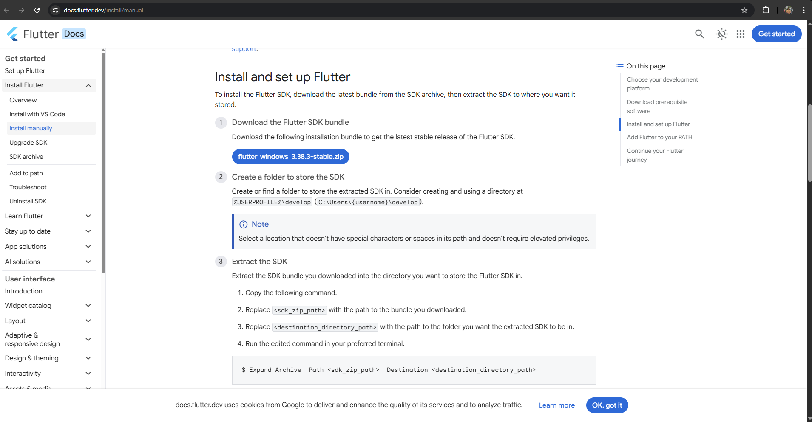

### Langkah 1.2: Ekstrak Flutter SDK
1. Setelah download selesai, buka folder **Downloads**
2. Ekstrak file `flutter_windows_x.x.x-stable.zip` ke lokasi yang diinginkan
3. **Rekomendasi**: Ekstrak ke `C:\src\flutter` (pastikan path tidak mengandung spasi atau karakter khusus)
4. **Catatan**: Jangan letakkan Flutter di folder yang memerlukan elevated privileges seperti `C:\Program Files\`

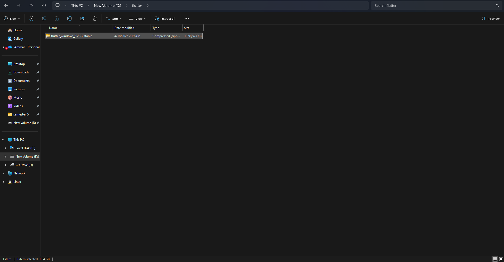
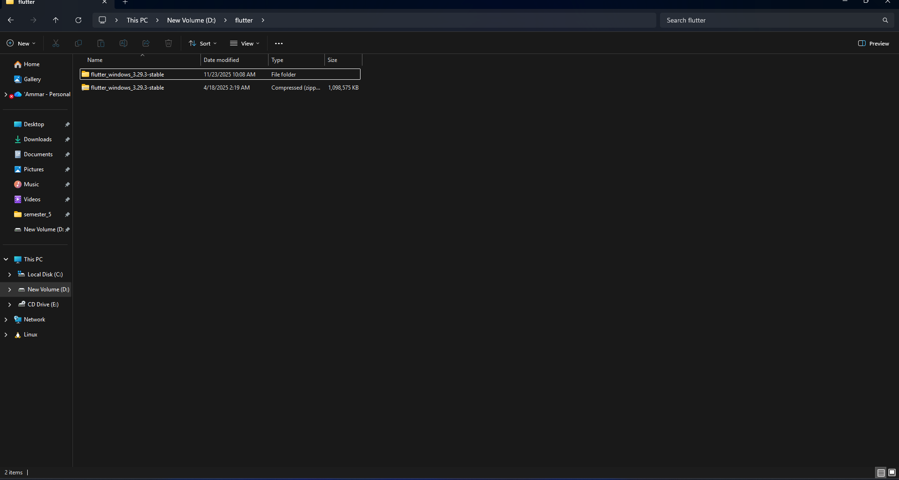

---

## 2. Menambahkan Flutter ke Environment Variables

### Langkah 2.1: Menambahkan Flutter ke PATH
1. Buka folder yang sudah diekstrak (contoh: `C:\src\flutter`).
2. Masuk ke folder `bin`.
3. Klik pada address bar di File Explorer lalu copy path (hasil contohnya: `C:\src\flutter\bin`).

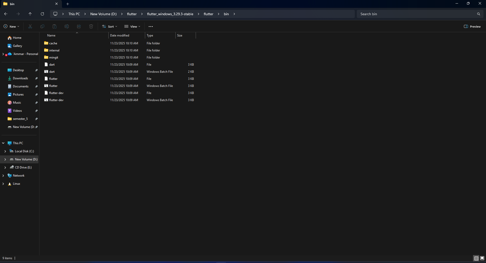

4. Buka Run (`Windows + R`), ketik `sysdm.cpl` lalu tekan Enter.
5. Pada jendela System Properties, klik tab **Advanced** lalu klik **Environment Variables**.

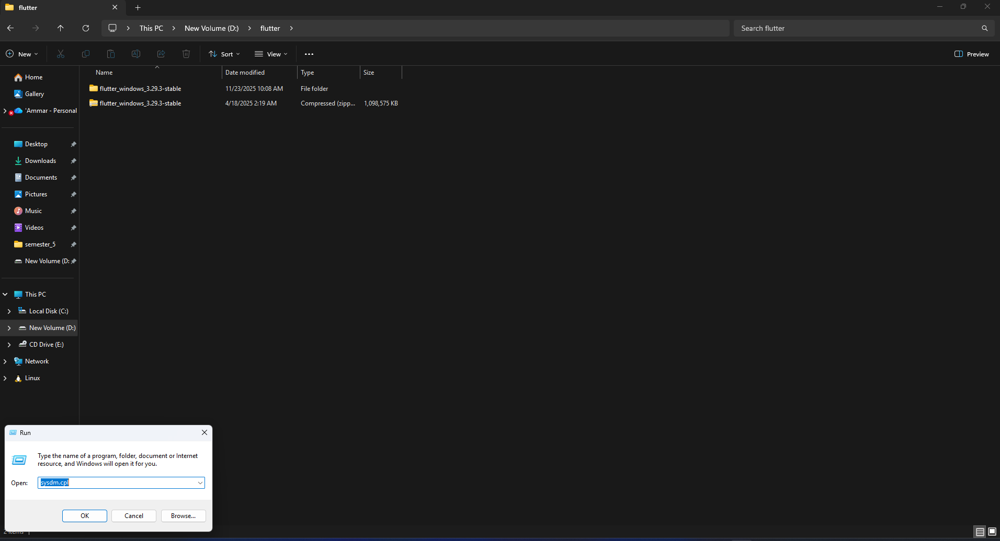
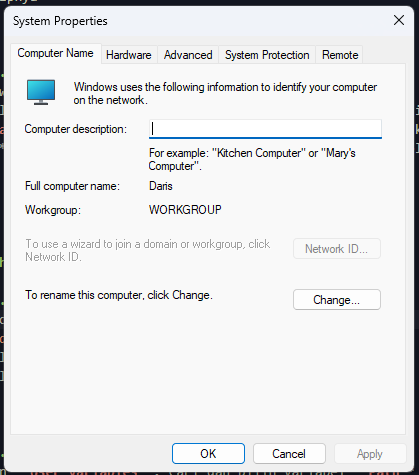
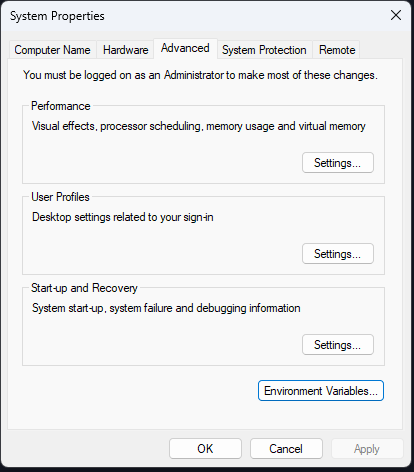

6. Pada bagian **System variables**, pilih variabel **Path** lalu klik 2 kali.

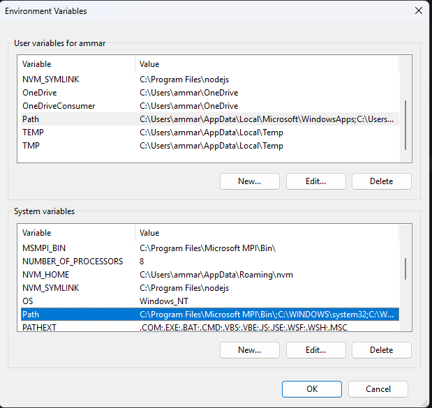

7. Klik **New**, lalu paste path `C:\src\flutter\bin` yang sudah Anda copy.
8. Klik **OK** pada semua jendela untuk menyimpan perubahan.

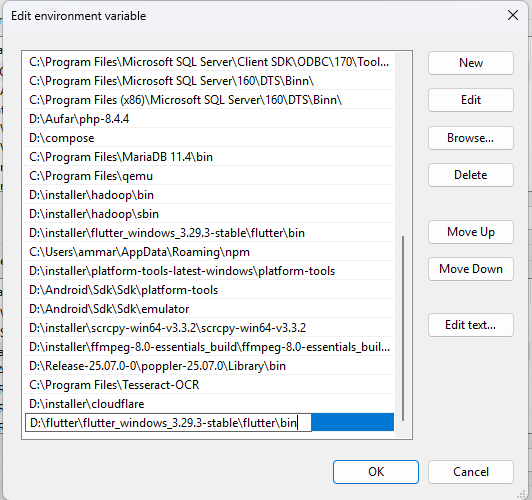

### Langkah 2.2: Verifikasi Instalasi Flutter
1. Buka **PowerShell** atau **Command Prompt** baru.
2. Jalankan perintah berikut:
   ```powershell
   flutter --version
   ```
3. Jika berhasil, Anda akan melihat informasi versi Flutter yang terinstal


---

## 3. Menjalankan Flutter Doctor

### Langkah 3.1: Memeriksa Dependency
Flutter Doctor adalah tool untuk memeriksa apakah semua dependency sudah terinstal dengan benar.

1. Buka terminal (PowerShell atau Command Prompt)
2. Jalankan perintah:
   ```powershell
   flutter doctor
   ```
3. Periksa output untuk melihat komponen mana yang perlu diinstal atau dikonfigurasi

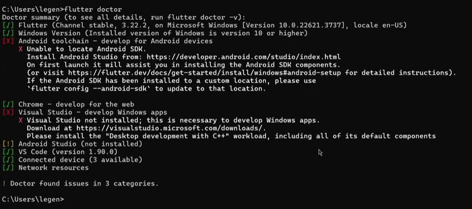

### Langkah 3.2: Mengatasi Issues (Jika Ada)
Flutter Doctor akan menampilkan tanda:
- ✓ (checkmark hijau): Sudah terinstal dengan benar
- ✗ (silang merah): Belum terinstal atau ada masalah
- ! (warning kuning): Optional, tidak wajib tetapi direkomendasikan

---

## 4. Instalasi Android Studio

### Langkah 4.1: Download Android Studio
1. Buka browser dan kunjungi: [https://developer.android.com/studio](https://developer.android.com/studio)
2. Klik tombol **Download Android Studio**
3. Setujui Terms and Conditions
4. Klik **Download** untuk mengunduh installer

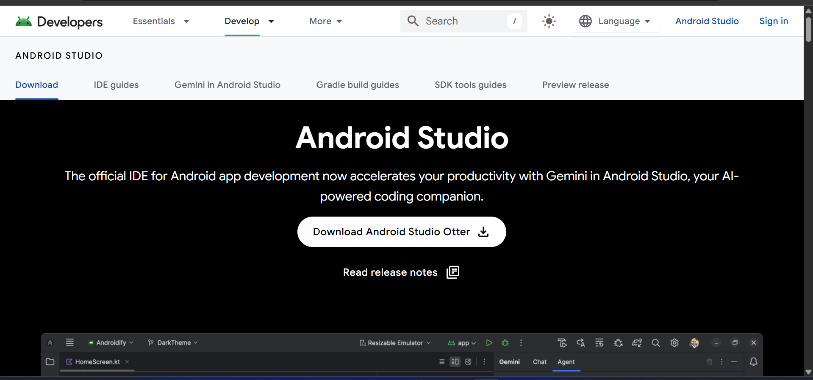

### Langkah 4.2: Instalasi Android Studio
1. Jalankan file installer yang sudah didownload (`android-studio-xxx.exe`)
2. Ikuti wizard instalasi
3. Pilih **Standard** installation type
4. Klik **Next** hingga instalasi selesai
5. Klik **Finish** untuk meluncurkan Android Studio

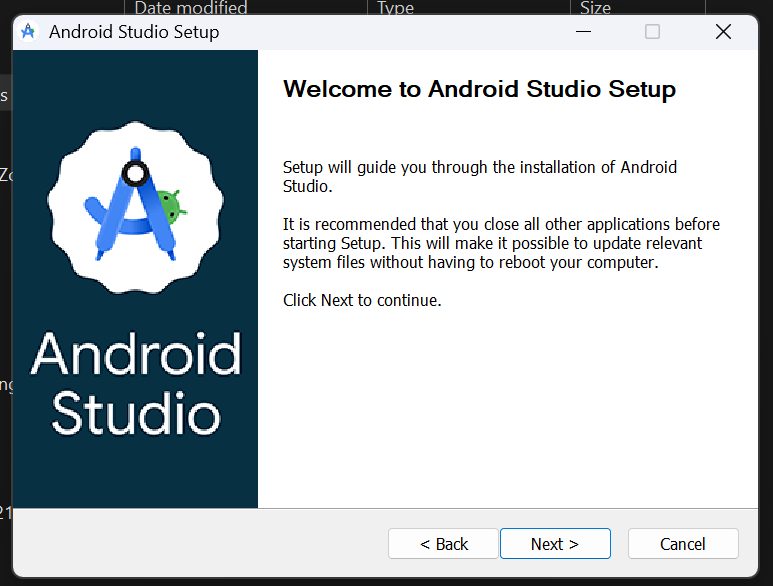

### Langkah 4.3: Konfigurasi Awal Android Studio
1. Pada welcome screen, pilih **Standard setup**
2. Pilih tema yang diinginkan (Light/Dark)
3. Klik **Next** dan tunggu hingga Android Studio mendownload komponen yang diperlukan (SDK, emulator, dll)
4. Klik **Finish** setelah setup selesai

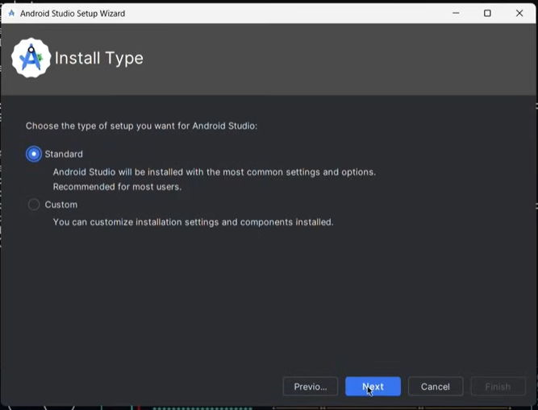
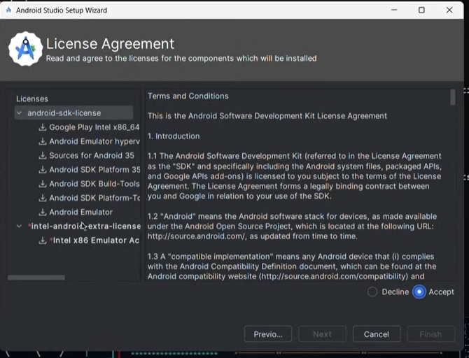

---

## 5. Instalasi Flutter dan Dart Plugin

### Langkah 5.1: Membuka Plugin Manager
1. Buka Android Studio
2. Pada welcome screen, klik **Plugins** di menu sebelah kiri
   - Atau jika sudah ada project terbuka: **File → Settings → Plugins**
3. Klik tab **Marketplace**
4. Pada kolom search, ketik `Flutter`
5. Cari plugin **Flutter** (by flutter.io)
6. Klik tombol **Install**
7. Android Studio akan otomatis menyarankan untuk menginstal **Dart plugin** juga
8. Klik **Yes** untuk menginstal Dart plugin
9. Klik **Restart IDE** setelah instalasi selesai

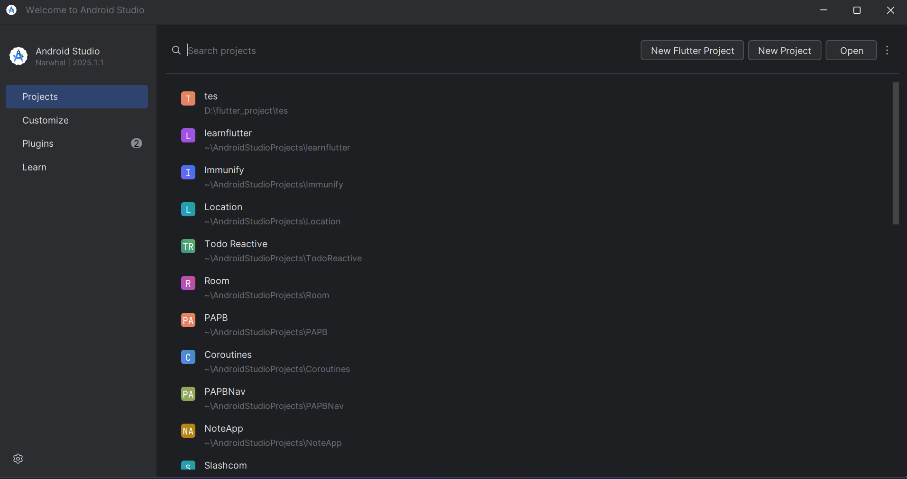

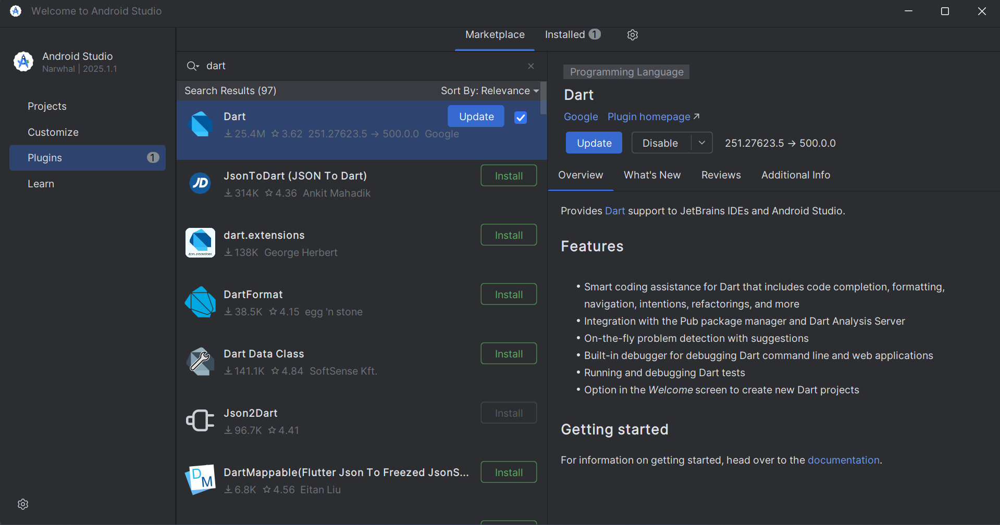

---

## 6. Konfigurasi Flutter SDK di Android Studio

### Langkah 6.1: Setting Flutter SDK Path
1. Buka Android Studio
2. Klik **File → Settings** (atau tekan `Ctrl + Alt + S`)
3. Navigasi ke **Languages & Frameworks → Flutter**
4. Pada field **Flutter SDK path**, masukkan path: `C:\src\flutter` (sesuaikan dengan lokasi instalasi Anda)
5. Klik **Apply** dan **OK**

`[Screenshot: Android Studio Settings - Flutter SDK Path]`

### Langkah 6.2: Verifikasi Konfigurasi
1. Jalankan perintah `flutter doctor` kembali di terminal
2. Pastikan Android Studio sudah terdeteksi dengan checkmark hijau

`[Screenshot: Flutter doctor menunjukkan Android Studio terdeteksi]`

---

## 7. Setup Android SDK dan Accept Licenses

### Langkah 7.1: Accept Android Licenses
1. Buka terminal (PowerShell atau Command Prompt)
2. Jalankan perintah:
   ```powershell
   flutter doctor --android-licenses
   ```
3. Tekan `y` (yes) untuk menerima semua lisensi Android SDK
4. Tunggu hingga proses selesai

`[Screenshot: Proses accept Android licenses di terminal]`

---

## 8. Membuat Project Flutter Baru

### Langkah 8.1: New Flutter Project via Android Studio
1. Buka Android Studio
2. Pada welcome screen, klik **New Flutter Project**
   - Atau: **File → New → New Flutter Project**
3. Pilih **Flutter** dari sidebar kiri
4. Pastikan **Flutter SDK path** sudah terisi dengan benar
5. Klik **Next**

`[Screenshot: New Flutter Project - Select Project Type]`

### Langkah 8.2: Konfigurasi Project
1. **Project name**: Masukkan nama project (contoh: `my_first_app`)
   - Gunakan huruf kecil dan underscore, tanpa spasi
2. **Project location**: Pilih lokasi folder untuk menyimpan project
3. **Description**: Isi deskripsi project (opsional)
4. **Organization**: Masukkan organization identifier (contoh: `com.example`)
5. **Android language**: Pilih **Kotlin** (rekomendasi)
6. **iOS language**: Pilih **Swift** (rekomendasi)
7. **Platforms**: Centang platform yang ingin didukung (Android, iOS, Web, dll)
8. Klik **Finish**

`[Screenshot: Configure New Flutter Project - Project Details]`

### Langkah 8.3: Menunggu Project Dibuat
1. Android Studio akan membuat struktur project Flutter
2. Tunggu hingga proses indexing dan download dependencies selesai
3. Perhatikan progress bar di bagian bawah Android Studio

`[Screenshot: Android Studio creating Flutter project dan indexing]`

---

## 9. Menjalankan Flutter App

### Langkah 9.1: Setup Emulator atau Device
**Opsi A: Menggunakan Android Emulator**
1. Di Android Studio, klik **Device Manager** (ikon handphone di toolbar)
2. Klik **Create Device**
3. Pilih hardware device (contoh: Pixel 5)
4. Pilih system image (rekomendasi: API 33 atau terbaru)
5. Klik **Download** jika belum terdownload
6. Beri nama emulator, lalu klik **Finish**
7. Klik tombol **Play** untuk menjalankan emulator

`[Screenshot: Device Manager - Create Virtual Device]`

**Opsi B: Menggunakan Physical Device**
1. Aktifkan **Developer Options** di smartphone Android
2. Aktifkan **USB Debugging**
3. Hubungkan smartphone ke komputer via USB
4. Pilih **File Transfer** mode di smartphone
5. Device akan muncul di dropdown device selector Android Studio

`[Screenshot: Device selector menampilkan connected device]`

### Langkah 9.2: Running Flutter App
1. Pastikan device/emulator sudah aktif dan terdeteksi
2. Pilih device dari dropdown di toolbar
3. Klik tombol **Run** (ikon play hijau) atau tekan `Shift + F10`
4. Tunggu proses build dan deploy selesai
5. Aplikasi akan muncul di emulator/device

`[Screenshot: Flutter app running di emulator - default counter app]`

### Langkah 9.3: Hot Reload
Saat melakukan perubahan kode:
1. Simpan file dengan `Ctrl + S`
2. Klik tombol **Hot Reload** (ikon petir) atau tekan `Ctrl + \`
3. Perubahan akan langsung terlihat tanpa rebuild penuh

`[Screenshot: Toolbar Android Studio menunjukkan tombol Hot Reload]`

---

## 10. Verifikasi Final Setup

### Checklist Verifikasi
Jalankan `flutter doctor -v` untuk verifikasi lengkap:

```powershell
flutter doctor -v
```

Pastikan semua komponen menampilkan status ✓:
- ✓ Flutter (Channel stable)
- ✓ Windows Version
- ✓ Android toolchain
- ✓ Chrome (untuk web development)
- ✓ Android Studio
- ✓ VS Code (opsional)
- ✓ Connected device

`[Screenshot: Output flutter doctor -v showing all checks passed]`

---

## Troubleshooting

### Masalah Umum dan Solusi

**1. Flutter command not found**
- Solusi: Pastikan PATH environment variable sudah diset dengan benar dan restart terminal

**2. Android licenses not accepted**
- Solusi: Jalankan `flutter doctor --android-licenses` dan accept semua

**3. Emulator tidak muncul**
- Solusi: Pastikan Intel HAXM atau AMD Hypervisor sudah terinstal (via SDK Manager)

**4. Build failed - SDK not found**
- Solusi: Verify Android SDK location di Android Studio settings

**5. Unable to locate ADB**
- Solusi: Add Android SDK platform-tools to PATH: `C:\Users\[Username]\AppData\Local\Android\Sdk\platform-tools`

---

## Resources Tambahan

- **Official Documentation**: [https://docs.flutter.dev](https://docs.flutter.dev)
- **Flutter Community**: [https://flutter.dev/community](https://flutter.dev/community)
- **Pub.dev (Flutter Packages)**: [https://pub.dev](https://pub.dev)
- **Flutter Samples**: [https://flutter.github.io/samples/](https://flutter.github.io/samples/)
- **Codelabs**: [https://docs.flutter.dev/codelabs](https://docs.flutter.dev/codelabs)

---

## Selamat! 🎉

Environment Flutter Anda sudah siap digunakan. Anda sekarang dapat mulai mengembangkan aplikasi mobile dengan Flutter!

---

*Last updated: November 2025*
